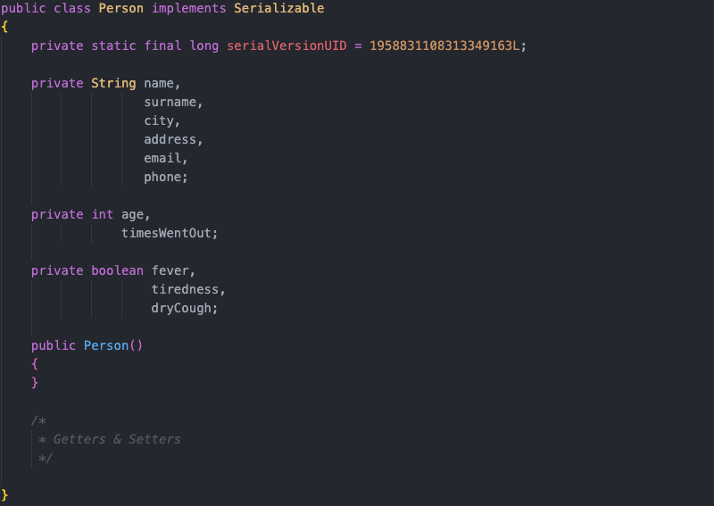
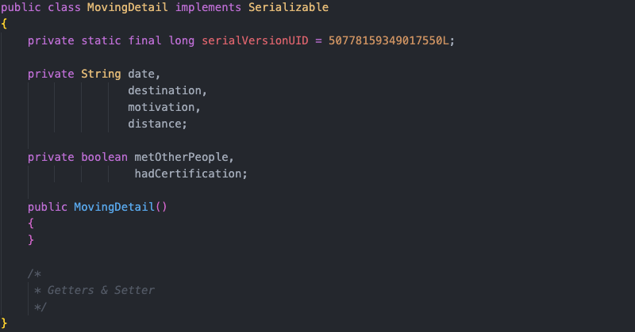
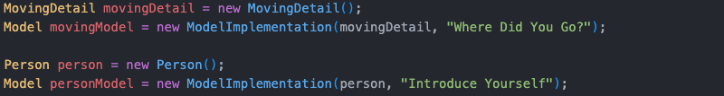
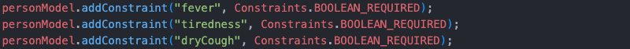
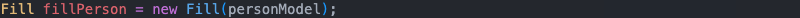
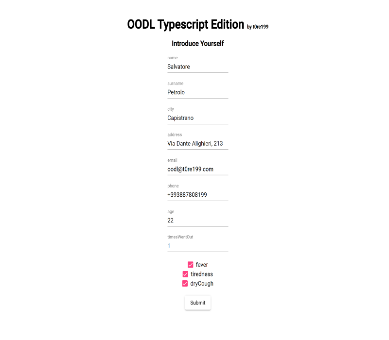
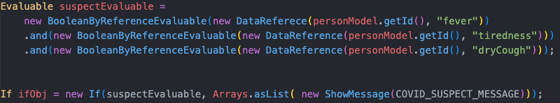
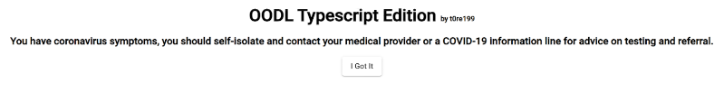
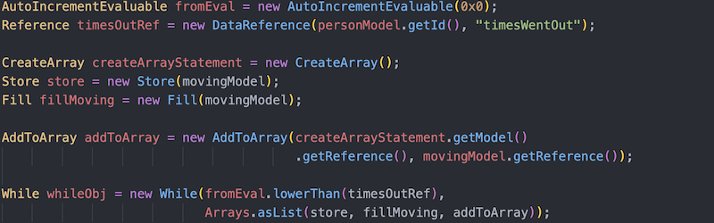
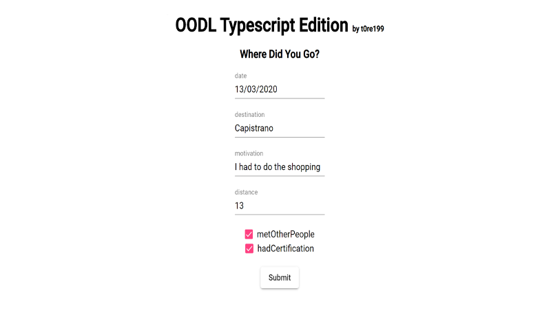

# README #

**O**bject **O**riented **D**ata **L**anguage (**OODL**) is an imperative programming language i devoloped for my **bacelor's degree thesis**. OODL is not open-source (yet?), this repo hosts only a demo.   
   
OODL makes developing a web application for collecting data as easy as instantiating an object in any object oriented programmin language.   
    
The idea behind OODL is to think at the data collection process as a program to be implemented in some kind of language.   

## OODL Characteristics ##

OODL was designed to allow devolopers to build **dynamic** web applications for data collections (also very complex ones) which **execute client-side**.  

* OODL is an **interpreted** language, written in **TypeScript**. It can run on any browser since it was developed by using the ecma-262 standard. OODL's interpreter recevices programs in JSON format.   
   
* OODL is a **weak typed** language. However developer can add type constraints by means of OODL's **Contraint** feature;  

* OODL provides typical high level programming languages' functionalities (e.g. control flow structure, dynamic types, etc).   

### Language's Elements ###

* **Objects & Variable**: they can be used by means of OODL's **Model**.

* **Contraint**: it can be used to specify constraints on model's properties. Constraints can be either about mandatoriety/optinality or data type (boolean, number, string, etc).   

* **Reference**: you could think of it as a pointer.    

* **Array**: OODL also supports arrays. They are 0-indexed and automatically resized (as happen in Javascript).  

### Control Flow Structures ###

* **Sequence**   

* **If**   

* **\[Do\]While**  

## OODL System ##

OODL is part of a three-tier based system.  

### Backend ###

The backend was developed by using the **Java Enterprise Edition 7** stack. The JAX-RS Api has been used to implement **REST Web Services** while the Java Persistence Api (**JPA**) and the ORM Hibernate have been used for persistency.   

### Frontend ###

A single page application has been provided. It was built with the **Angular** framework. Many UI component were taken from [Angular Material](https://material.angular.io/).

### Data ###

[PostgreSQL](https://www.postgresql.org/) has been used as OR-DBMS.

## Data Collection Example ##

Suppose you want to develop a web application to collect useful data about Covid-19. In particular, you want to collect, for a given person: name, surname, city, address, age and the number of times he/she went out in the previous 15 days. For each time the person went out, suppose you are interessed in collecting: date, moving's reason, distance and if the person had a certification. Moreover, you want to check whether the person has Covid-19's symptoms. If so, you want a warning message about a possible Covid-19 infection to appear.   

### Data Collection Schema ###

1. Ask the person to insert the above listed data.
2. Check if the person has Covid-19's symptoms    
    2.1. If so, show a warning.
3. For each time the person went out:   
    3.1. Ask the moving details.

### Defining Objects ###

**Person** java class definition. 
     
   

**Moving Detail** java class definition.  
    
       
   
 
### Defining OODL Program ###

Creating OODL models.   
     
      

Since some property are mandatory, let's specify a constraint.   
    
     
   
Now we use OODL's **Fill** instruction to build the corresponding form. At this point, step 1 is completed.   
   
   
    
  
    
Step 2 & 2.1: Let's check Covid-19's symptoms.    
    
     
   
   
    
Eventually, let's code the point 3.   
   
  
    
 